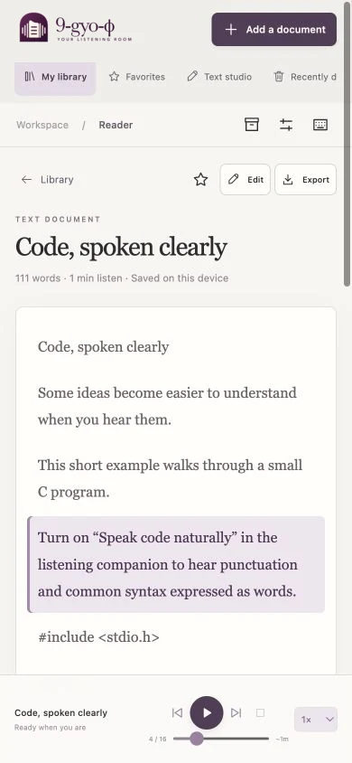
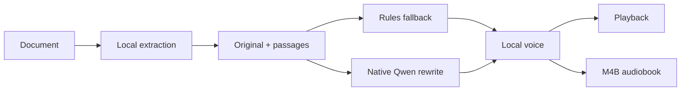

<p align="center">
  
</p>

<p align="center">
  A private, local-first reading room that turns documents into natural speech and complete M4B audiobooks.
</p>

<p align="center">
  <a href="https://github.com/anpu-ai-official/9-gyo-phi/actions/workflows/ci.yml"></a>
  <a href="LICENSE"></a>
  
  
</p>

<p align="center">
  <a href="#why-9-gyo-φ">Why</a> ·
  <a href="#quick-start">Quick start</a> ·
  <a href="#how-it-works">Architecture</a> ·
  <a href="ROADMAP.md">Roadmap</a> ·
  <a href="CONTRIBUTING.md">Contributing</a>
</p>

<p align="center">
  
  
</p>

## Why 9-gyo-φ?

Most read-aloud tools treat a document as plain prose. 9-gyo-φ preserves the original book while preparing a separate listening version that understands code, notation, dates, measurements, links, abbreviations, and structured steps.

Everything important happens on your device:

- no account, subscription, analytics, advertising, or document-processing cloud;
- native Qwen speech preparation through a pinned llama.cpp sidecar;
- native Kokoro narration through Rust and quantized ONNX Runtime;
- deterministic speech rules whenever the local LLM is unavailable;
- complete local M4B creation with an integrated position-saving player.

Apple Silicon macOS is the currently verified desktop release. Intel macOS, Windows x64, and Linux x64 build candidates are exercised by the repository's platform matrix and graduate to supported status only after signed installers and real-model smoke tests pass. See the [platform support contract](docs/platform-support.md).

## Highlights

- **Bring real books.** Import PDF, EPUB, HTML, Markdown, or UTF-8 text while retaining the original file for export.
- **Hear technical writing naturally.** A default-on local preparation pass rewrites written notation for speech without altering the source.
- **Navigate links normally.** PDF links navigate on click; a separate hover control narrates link text.
- **Make an audiobook.** Stream a whole book passage-by-passage into a locally stored AAC M4B instead of holding hours of PCM in memory.
- **Keep your place.** Notes, favorites, bookmarks, reading progress, audiobook position, and drafts persist locally.
- **Recover safely.** Recently deleted documents can be restored, and complete versioned library backups can be exported.
- **Use it without a mouse.** Keyboard shortcuts, focus-visible controls, accessible dialogs, reduced motion, and responsive layouts are built in.

## Supported content

| Format                   | Import | Original export | Complete M4B |
| ------------------------ | :----: | :-------------: | :----------: |
| PDF with selectable text |   ✓    |        ✓        |      ✓       |
| EPUB                     |   ✓    |        ✓        |      ✓       |
| HTML                     |   ✓    |        ✓        |      ✓       |
| Markdown                 |   ✓    |        ✓        |      ✓       |
| UTF-8 TXT / pasted text  |   ✓    |        ✓        |      ✓       |

Image-only PDFs need OCR before import. DRM-protected or password-protected books need an accessible, unlocked copy; this project does not bypass access controls.

## Quick start

### Browser preview

Requires Node.js 22 LTS or Node.js 24 or newer:

```sh
git clone https://github.com/anpu-ai-official/9-gyo-phi.git
cd 9-gyo-phi
npm ci
npm start
```

Open `http://127.0.0.1:8766`. The preview server binds only to loopback. It uses deterministic speech preparation and a Kokoro WebAssembly worker; native Qwen and M4B creation are desktop-only.

### Native desktop app

Install stable Rust, CMake, and the platform prerequisites in the [contribution guide](CONTRIBUTING.md), then:

```sh
npm ci
npm run verify
npm run build
```

Platform installers are written under `src-tauri/target/release/bundle/`. The first production build compiles a pinned, static llama.cpp sidecar for the current target. Model weights are not embedded in the app:

- Qwen 2.5 Coder 3B Q4_K_M: approximately 2.1 GB, installed explicitly from **Local model**;
- quantized Kokoro plus five voices: approximately 100 MB, installed on first Kokoro use.

Downloads use fixed upstream URLs and SHA-256 verification. Public distribution additionally requires platform signing credentials; unsigned cross-platform builds remain release candidates rather than supported releases.

## How it works



The desktop app is a Tauri shell around a framework-free web interface. PDF.js and fflate handle local documents; Rust owns URL safety, model downloads, llama.cpp lifecycle, native Kokoro, system speech, and audiobook encoding. See [the architecture guide](docs/architecture.md) for trust boundaries and component details.

The packaged runtime contains no Python, MLX, Torch, or Docling. The native llama.cpp HTTP endpoint is loopback-only and model prompts treat document contents as untrusted data.

## Privacy

Documents, notes, library metadata, generated audio, and local model inference remain on the device. Network access occurs only for a user-requested URL import or model download. Browser cloud voices are excluded.

Read [the privacy and data-handling guide](docs/privacy.md) before using the app with sensitive material. Library backups are complete, portable, and unencrypted.

## Development

```sh
npm run check          # ESLint, Prettier, and deterministic frontend tests
npm run verify:assets  # SHA-256 checks for vendored browser assets and voices
npm run check:desktop  # rustfmt and strict Clippy
npm run test:desktop   # Rust tests
npm run verify         # complete local contribution gate
npm run test:native-models # opt-in real Qwen and Kokoro tests
```

The deterministic suite covers storage migrations, document validation, URL boundaries, speech routing, code and notation preservation, cancellation races, WAV framing, M4B metadata, PDF link behavior, and browser privacy. The opt-in suite exercises all ten narration case studies against real Qwen and verifies non-silent PCM from real native Kokoro.

See [CONTRIBUTING.md](CONTRIBUTING.md) for the review standard, [SECURITY.md](SECURITY.md) for private vulnerability reporting, and [SUPPORT.md](SUPPORT.md) for help channels.

## Project status

9-gyo-φ is a pre-1.0 project. The Apple Silicon build, EPUB-to-M4B path, local models, deterministic tests, and packaged application have been exercised end-to-end. Cross-platform Rust services and packaging targets exist for Intel macOS, Windows x64, and Linux x64; the support table records exactly which combinations have passed real hardware, signing, and installer validation.

Current direction lives in [ROADMAP.md](ROADMAP.md). Release notes live in [CHANGELOG.md](CHANGELOG.md). Brand usage and production assets are documented in [docs/brand-assets.md](docs/brand-assets.md).

The latest end-to-end evidence, artifact sizes, and native-model results are recorded in [docs/verification.md](docs/verification.md).

## License and attribution

9-gyo-φ is available under the [MIT License](LICENSE). Third-party runtimes, vendored browser assets, voice packs, and model weights retain their respective licenses; see [THIRD_PARTY_NOTICES.md](THIRD_PARTY_NOTICES.md).

If 9-gyo-φ makes long or technical reading easier for you, star the repository, share a small reproducible issue, or help improve one listening edge case.
