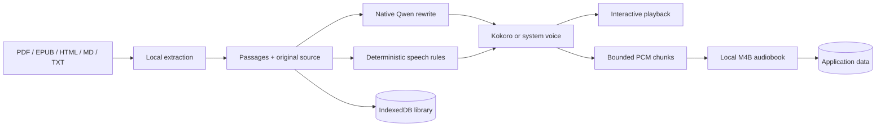

# Architecture

9-gyo-φ is a Tauri desktop application with a framework-free web interface and native Rust services. Document contents stay on the user's device.

## Components

| Component                    | Responsibility                                                                                    |
| ---------------------------- | ------------------------------------------------------------------------------------------------- |
| `src/static/app.js`          | Library, reader, imports, dialogs, settings, exports, and orchestration                           |
| `src/static/core.js`         | Validation, segmentation, history, URL rules, and WAV encoding                                    |
| `src/static/parser.js`       | PDF spatial ordering and deterministic code narration rules                                       |
| `src/static/speech.js`       | Universal LLM-first speech preparation with safe fallback                                         |
| `src/static/audio.js`        | Cancel-safe playback and native/browser Kokoro selection                                          |
| `src/static/storage.js`      | IndexedDB schema, migrations, document bytes, and audiobook metadata                              |
| `src-tauri/src/lib.rs`       | URL fetch boundary, platform capabilities, model management, llama.cpp control, and native speech |
| `src-tauri/src/audiobook.rs` | Streaming pure-Rust AAC encoding and M4B assembly                                                 |

## Import pipeline

- PDF.js renders and extracts PDFs. Link annotations remain navigation controls; narration is a separate hover action.
- EPUB files are decompressed locally with fflate, then read in OPF spine order.
- HTML is sanitized into listening structure; Markdown and TXT use deterministic segmentation.
- Original bytes are stored independently from metadata so progress writes do not rewrite large documents.

## Speech pipeline

Every enabled passage first receives a deterministic faithful fallback. If the native Qwen model is installed, the original passage and its code classification are sent to a loopback-only llama.cpp server using a constrained rewrite prompt. Model output is sanitized before reaching the selected voice.

The desktop Kokoro path uses the pinned `kokoro-en` Rust library and quantized ONNX Runtime. The browser preview uses the vendored WebAssembly worker. System speech is restricted to local OS voices and is exposed only when a supported local provider is present. Kokoro remains the consistent cross-platform default.

The Qwen model is platform-independent GGUF data. A target-named llama.cpp executable is compiled and packaged for each desktop artifact. Apple Silicon uses Metal; other initial targets use a portable CPU baseline so unsupported GPU drivers never prevent narration. Accelerated Windows and Linux backends can be added without changing document or speech-preparation contracts.

## Audiobook pipeline

M4B creation transforms and synthesizes one passage at a time. Float PCM is converted to bounded 16-bit chunks and appended by Rust. The frontend never holds a full-book waveform. During finalization, the pure-Rust AAC encoder reads one 1,024-sample frame at a time and writes it into an MP4/M4B container before atomically moving the completed audiobook into application data. No Python, FFmpeg, `afconvert`, or system codec is required.

## Trust boundaries

- Imported files and URLs are untrusted data.
- Model output is untrusted transformation output and cannot trigger tools or filesystem actions.
- Remote model assets are accepted only after SHA-256 verification.
- The llama.cpp HTTP interface binds to `127.0.0.1` and disables its web UI.
- Asset-protocol scope is limited to the audiobook directory.
- External PDF links accept only HTTP, HTTPS, and mailto schemes without embedded credentials.

See `SECURITY.md` for vulnerability reporting and `docs/privacy.md` for the user-facing data inventory.
